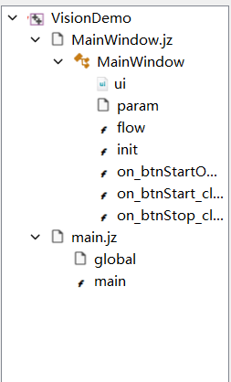
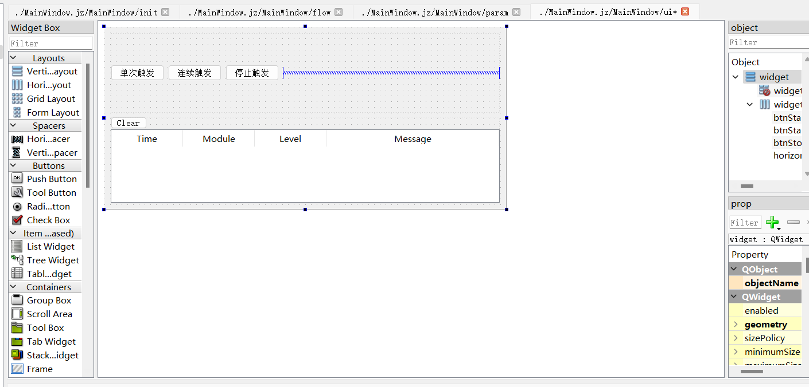
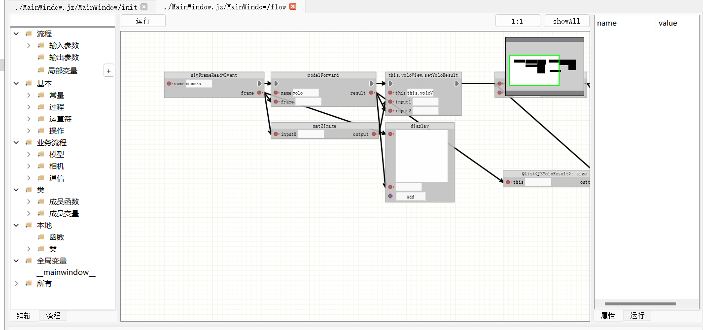
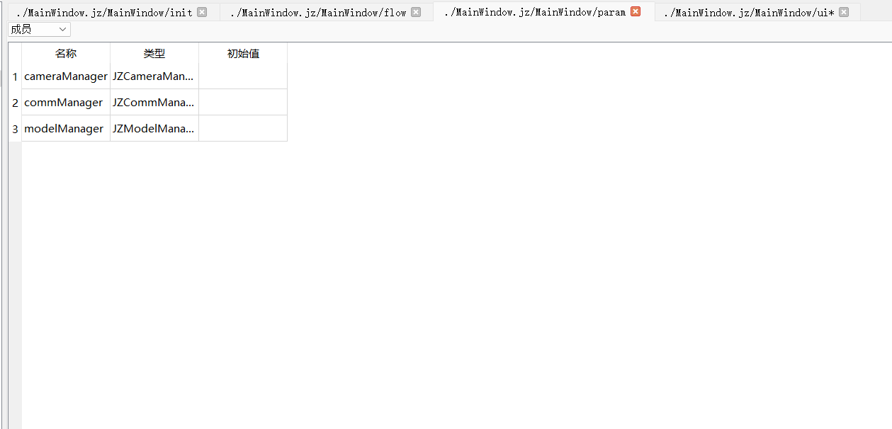
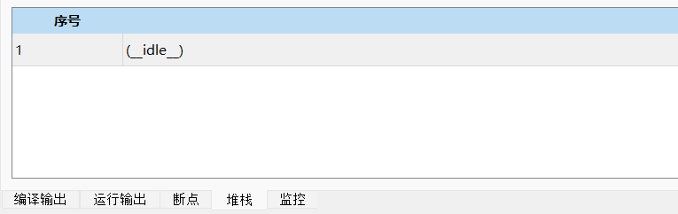

# JZNodeEditor 界面说明

## 1.解决方案管理
- 位于界面左侧
- 
- 解决方案切换：
  - 通过文件打开/新建解决方案    
- 解决方案树形结构：
  - 支持节点/脚本的拖拽排序
  - 右键菜单提供复制/粘贴/重命名功能

## 2.ui设计器
- 位于界面中间，选择ui文件后，会显示ui设计器界面

### 2.1 控件栏
- 左侧垂直工具栏包含以下核心控件：
- **基础控件**：
  - 按钮（Button）
  - 输入框（Input）
  - 复选框（Checkbox）
  - 下拉菜单（Select）
- **容器控件**：
  - 面板（Panel）
  - 选项卡（TabView）
  - 滚动容器（ScrollView）
- **特殊控件**：
  - 数据表格（DataGrid）
  - 树形控件（TreeView）
  - 图表组件（Chart）

### 2.3 控件画布
- 支持控件拖拽、缩放、平移
- 支持控件自由布局
  
### 2.3 属性设计
- 右侧属性栏可以修改属性：

## 3.节点设计器
- 位于界面中间，选择函数/流程后，会显示节点设计器界面

### 3.1 节点栏
- 左侧工具栏提供以下节点类型：
- **逻辑节点**：条件分支、循环控制
- **数据节点**：数据库连接、API调用
- **业务节点**：摄像头、模型等
- **自定义节点**（支持拖拽创建）

### 3.2 节点画布
- 支持节点拖拽、缩放、平移
- 支持节点自由布局
- 支持节点连接
- 支持节点分组
- 支持节点操作：
  - 双击节点可编辑
  - 复制/粘贴    
  - 显示类型详情
- 节点连接方式：
- **拖拽连接线**建立节点关系
- 支持：
  - 单输出→多输入（广播模式）
  - 类型匹配校验（连接点颜色标识）
  - 快速断开（点击连接线删除）

- 自动布局功能：
  - 提供节点自动布局功能
   
### 3.3 节点属性
- 右侧属性栏显示节点属性

## 4.参数设计器
- 位于界面中间，选择参数后，会显示节点设计器界面
- 
### 4.1 参数管理
- 增加删除参数

### 4.2 参数绑定
- 提供界面参数绑定功能

## 5.调试视图
- 位于界面下方，包含日志，断点，调用栈，变量监视等

### 5.1 断点管理器
- 实时显示程序执行断点
- 双击节点可添加/移除断点
- 右键菜单支持：
  - 导出断点信息
  - 清空所有断点

### 5.2 调用堆栈查看器
- 实时显示程序执行调用栈
- 双击堆栈帧可跳转到对应节点位置
- 上下文菜单支持：
  - 添加断点
  - 导出堆栈信息
  - 复制调用路径

### 5.3 变量监视器
- 表格形式展示当前作用域变量
- 支持表达式监视（如：array[0].length）
- 右键功能：
  - 修改变量值
  - 添加条件断点
  - 导出变量快照

### 5.4 日志控制台
- 多级日志过滤（INFO/WARN/ERROR）
- 支持日志内容搜索和高亮
- 右键菜单提供：  
  - 清空控制台
  - 时间戳显示开关