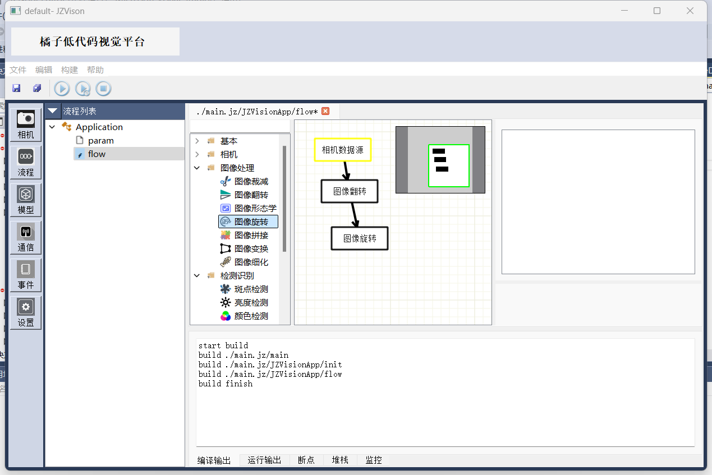

# JZVision 

## 1.1 简介
- JZVision 是用于机器视觉的低代码平台，包含视觉，引导，运动控制, 同时包含linux运行时用于开发智能相机
- 

## 1.2 核心优势
- 基于qt开发，单机应用，简单高效.
- 完整的程序功能，强类型，支持分支，循环，判断，信号，槽，泛型，类，lambda，实时预览，可以构建复杂应用
- 方便扩展，提供类似pybind接口，快速绑定c++
- 除节点编辑器外，提供等价脚本支持，也就是同时支持连线开发和脚本开发，可以互相调用
- aot支持，可以导出为c++代码
- 编辑器扩展，用户可以方便的扩展场景，构建属于自己的低代码应用
- 支持多线程，支持异步任务

## 1.3 下载
- 程序下载 
完整安装包: [下载](data/JZVision.zip) 
单独Exe,下载后覆盖完整安装包: [下载](data/JZVisionPlatform.exe) 
百度网盘: [下载](https://pan.baidu.com/s/1pNN5H__DcrE3DY6kef8jiA?pwd=i53h)  

- vc运行时下载
如果提示程序无法启用，请下载vc运行时 
vs2017 - vs2022 x64: [下载](https://aka.ms/vs/17/release/vc_redist.x64.exe) 
vs2015 x64: [下载](https://download.microsoft.com/download/9/3/f/93fcf1e7-e6a4-478b-96e7-d4b285925b00/vc_redist.x64.exe) 
